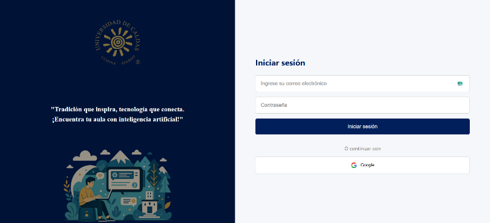
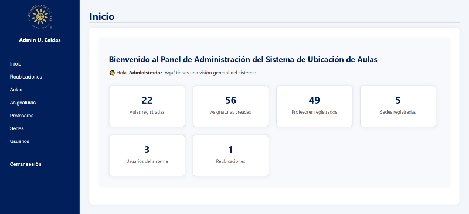
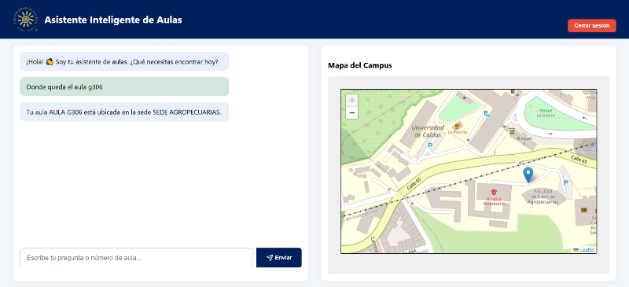

# 🏫 Sistema de Ubicación de Aulas – Universidad de Caldas

Este proyecto es un sistema inteligente que permite a estudiantes y administrativos ubicar aulas y gestionar asignaciones académicas mediante un panel de administración y un chatbot asistido con IA.

---

## 🧠 Funcionalidades destacadas

- Panel administrativo con gestión de sedes, aulas, asignaturas, profesores y usuarios.
- Asignación de profesores y aulas a asignaturas con validación de traslapes.
- Historial de cambios en la ubicación de asignaturas.
- Sistema de notificaciones por correo (patrón Observer).
- Importación/exportación de aulas y asignaciones vía Excel.
- Chatbot de ayuda integrado con acceso restringido por autenticación.
- Estadísticas del sistema al inicio del dashboard.
- Arquitectura en capas con principios SOLID.

---

## 🧱 Tecnologías utilizadas

- **Frontend:** React, Tailwind CSS, Axios
- **Backend:** Node.js, Express, PostgreSQL
- **Base de datos:** PostgreSQL
- **Autenticación:** OAuth2 (Google), login local con JWT
- **Patrones de diseño:** Factory Method, Proxy, Observer, Strategy
- **Otros:** Dotenv, Nodemailer, bcrypt, multer

---

## 🗂️ Estructura del proyecto

```
/frontend
├── src
│   ├── components/      # Botones, tablas, formularios reutilizables
│   ├── views/           # Vistas por módulo (Dashboard, Aulas, etc.)
│   ├── styles/          # Estilos por sección
│   └── App.js
```

```
/backend
├── controllers/         # Lógica de negocio organizada por módulo (coordinan servicios)
├── services/            # Reglas de negocio y orquestación entre repositorios y controladores
├── repositories/        # Acceso a datos: consultas SQL directas o mediante pool
├── domain/              # Modelos de dominio (clases como Usuario, Aula, etc.)
├── routes/              # Endpoints HTTP organizados por recurso (usuarios, aulas, etc.)
├── observers/           # Implementación del patrón Observer (ej. notificaciones por correo)
├── factories/           # Patrón Factory para creación de instancias (usuarios, login, etc.)
├── middlewares/         # Autenticación, validación de roles y otros middleware de Express
├── passport/            # Estrategias de autenticación (OAuth con Google, configuración de Passport)
├── config/db.js         # Configuración de conexión a PostgreSQL
├── database/            # Scripts de creación de tablas y relaciones, inserción de datos iniciales
└── server.js            # Punto de entrada de la aplicación Express
```

---

## 🚀 Instalación

### 1. Clonar el repositorio

```bash
git clone https://github.com/adolfobotero/sistema-ubicacion-aulas.git
git clone https://github.com/adolfobotero/backend-ubicacion-aulas.git
```

### 2. Configurar el backend

```bash
cd backend-ubicacion-aulas
npm install
```

Crear el archivo `.env` en el backend con la siguiente estructura:

```env
# Configuración de conexión a PostgreSQL
PG_USER=postgres
PG_HOST=localhost
PG_DATABASE=ubicacion_aulas
PG_PASSWORD=TU_CONTRASEÑA_DE_POSTGRES         # ← Reemplaza con tu contraseña local de PostgreSQL
PG_PORT=5432

# URL del frontend para permitir solicitudes (CORS)
FRONTEND_URL=http://localhost:3000

# Configuración del servidor y autenticación JWT
PORT=3001
JWT_SECRET=clave_super_secreta

# Credenciales de Google OAuth para inicio de sesión
GOOGLE_CLIENT_ID=TU_CLIENT_ID_GOOGLE          # ← Reemplaza con tu Client ID de Google
GOOGLE_CLIENT_SECRET=TU_CLIENT_SECRET_GOOGLE  # ← Reemplaza con tu Client Secret de Google
GOOGLE_CALLBACK=http://localhost:3001/auth/google/callback

# Configuración para envío de correos (notificaciones)
MAIL_USER=TU_CORREO@ucaldas.edu.co            # ← Reemplaza con el correo institucional desde el cual se enviarán notificaciones
MAIL_PASS=TU_CONTRASEÑA_DE_APLICACIÓN         # ← Reemplaza con la contraseña de aplicación generada en Gmail
```

### 3. Creación de la base de datos

Primero, asegúrate de tener PostgreSQL y PGAdmin instalados en tu equipo.
```
1. Abre **PGAdmin**.
2. En el panel izquierdo, haz clic derecho sobre `Databases` y selecciona **Create > Database**.
3. En el campo **Database name**, escribe: `ubicacion_aulas`.
4. Haz clic en **Save** para crear la base de datos.
```
Levantar el servidor:

```bash
node server.js
```

### 4. Configurar el frontend

```bash
cd sistema-ubicacion-aulas
npm install
```

Crear el archivo `.env` en el frontend con la siguiente estructura:

```env
# Rutas localhost BACKEND
REACT_APP_API_URL=http://localhost:3001
```

Iniciar el servidor de desarrollo:

```bash
npm start
```

---

## 🔒 Seguridad y acceso

- `/admin/dashboard`: solo accesible para administradores.
- `/chatbot`: accesible para usuarios autenticados con dominio `@ucaldas.edu.co`.
- Rutas protegidas con JWT y validación de roles mediante middlewares en el backend.

> El backend utiliza JWT para validar la sesión de los usuarios y un middleware tipo Proxy para restringir rutas según el rol del usuario.

---

## 👤 Autores

- **Luis Adolfo Botero** – Universidad de Caldas – [GitHub](https://github.com/adolfobotero)
- **Juan Esteban** – Universidad de Caldas
- **Yulay Andrea Castaño** – Universidad de Caldas
- **Magreth Quintero** – Universidad de Caldas
- **Camilo Osorio Latorre** – Universidad de Caldas

---

## 🖼️ Capturas del sistema






---

## 📜 Licencia

Proyecto académico – Universidad de Caldas – Manizales, Colombia.
